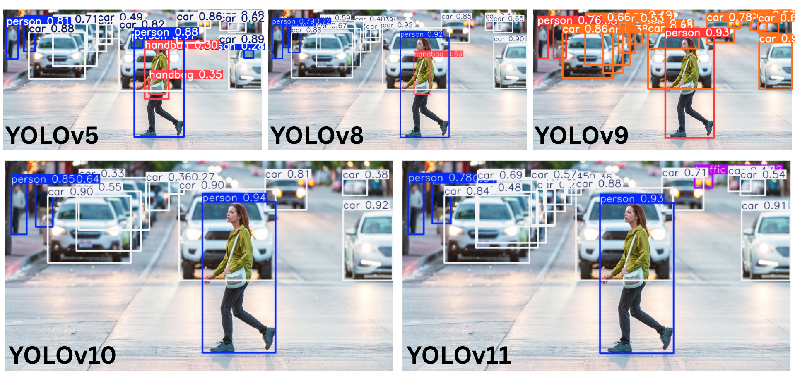
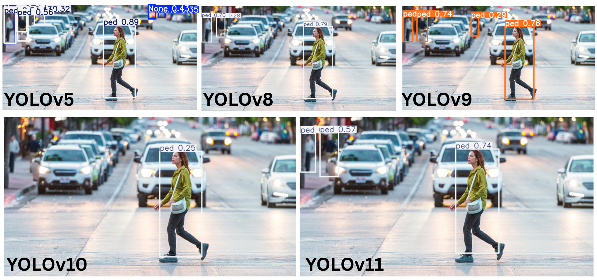

# MLPR-Final-Project
This repo contains all the code for Pedestrian and Obstacle Detection using OpenVino models and different Variants of YOLO (You Only Look Once). 

-----------
Notebooks included in the repository:
1. Yolov4-Tiny
2. Yolov5
3. Yolov8
4. Yolov9
5. Yolov10
6. Yolov11

-----------
## Comparison Between YOLO models 

### Pre-Trained Weights

### Fine-Tuned Weights

-----------
## Comparison Between YOLO models (prev)

------------

This repository is for the purposes of final project completion from the BUiD module "CSAI-403 Machine Learning and Pattern Recognition (MLPR) ".
